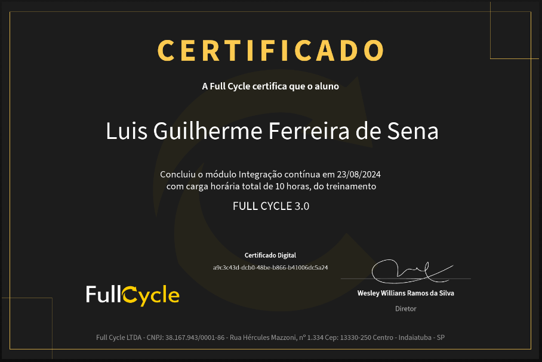

# Integração Contínua

## Conhecimentos Adquiridos
- Conceito de intergração Contínua
- Criação de Jobs (rotinas e subrotinas)
- Verificação de cobertura de código e ferramentas de *healthCheck* de código ([Sonarqube](https://docs.sonarsource.com/sonarqube/latest/))
- *Strategy Matrix*, trabalhar com várias versões da linguagem durante o processo de CI
- Fazer a criação/utilização/upload de imagens docker no processo de CI
- Utilização de [SonarCloud](https://docs.sonarsource.com/sonarcloud/) para fazer a análise do código via Cloud (nuvem)

## Certificado

[Link para o Certificado](https://fullcycle.com.br/certificado/a9c3c43d-dcb0-48be-b866-b41006dc5a24)
